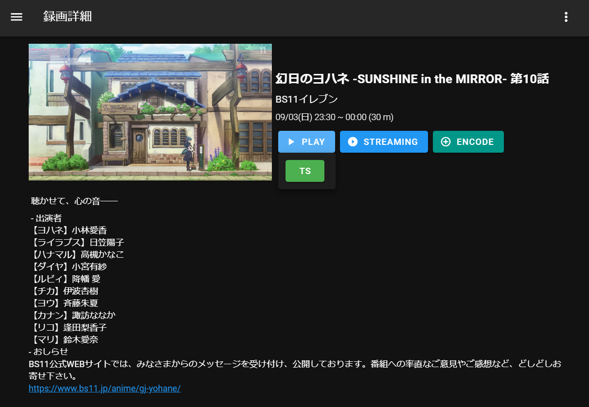

# EDCB-to-EPGStation
EDCBで録画が完了したらEPGStationに録画ファイルを登録するpythonスクリプト

## 表示例

## 使い方
EDCBの録画終了後のバッチファイルに `edcb_to_epgstation_ts.bat` を指定する  

config.yml.templateをconfig.ymlにコピーする。  
設定項目を編集する。こちらに必要事項を入力してください。

## 事前準備
exe化したので以下の作業は不要になりました。  
> pythonのインストール (3.10以上)とrequestsとpyyamlをインストールしてください。  
動かないことがあれば、自動で生成される test.log をご確認ください。(注意: logging.DEBUG 指定にすると解決しやすいかも)  
BUGなどあればご連絡ください

## うまく動作しないとき

powershell上で `edcb_to_epgstation_ts.bat` を実行してみてください。powershell上に問題が表示される場合があります。

## ビルド
* pyinstaller.exe .\edcb_to_epgstation_ts.py --onefile --name edcb_to_epgstation_ts_INFO.exe